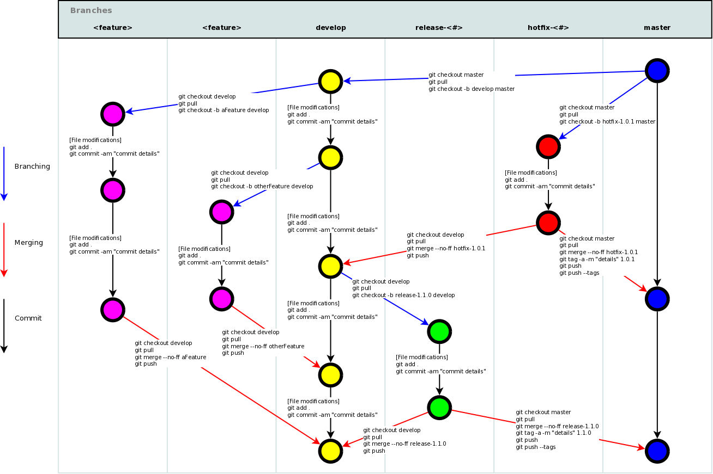

===============
<hr>
<p align="center">
    
</p>
<hr>

<hr>
Folha de dicas Git portugues
===============
### Índice
* [Configuração] (# configuração)
* [Arquivos de configuração] (# arquivos de configuração)
* [Criar] (# criar)
* [Mudanças locais] (# mudanças locais)
* [Pesquisa] (# pesquisa)
* [Histórico de confirmação] (# histórico de confirmação)
* [Ramos e etiquetas] (# ramos - etiquetas)
* [Atualizar e publicar] (# atualização - publicar)
* [Mesclar e redefinir] (# merge - rebase)
* [Desfazer] (# desfazer)
* [Git Flow] (# git-flow)


<hr>

## Configuração

##### Mostrar configuração atual:
`` ``
$ git config --list
`` ``
##### Mostrar a configuração do repositório:
`` ``
$ git config --local --list
`` ``

##### Mostrar configuração global:
`` ``
$ git config --global --list
`` ``

##### Mostrar a configuração do sistema:
`` ``
$ git config --system --list
`` ``

##### Defina um nome identificável para crédito ao revisar o histórico de versões:
`` ``
$ git config --global user.name “[firstname lastname]”
`` ``

##### Defina um endereço de email que será associado a cada marcador do histórico:
`` ``
$ git config --global user.email “[valid-email]”
`` ``

##### Defina a coloração automática da linha de comando para o Git para facilitar a revisão:
`` ``
$ git config --global color.ui auto
`` ``

##### Definir editor global para confirmação
`` ``
$ git config --global core.editor vi
`` ``

<hr>

## arquivos de configuração

##### Arquivo de configuração específico do repositório [--local]:
`` ``
<repo> /.git/config
`` ``

##### Arquivo de configuração específico do usuário [--global]:
`` ``
~ / .gitconfig
`` ``

##### Arquivo de configuração em todo o sistema [--system]:
`` ``
/ etc / gitconfig
`` ``

<hr>

## Crio

##### Clone um repositório existente:

Existem duas maneiras:

Via SSH

`` ``
$ git clone ssh: //user@domain.com/repo.git
`` ``

Via HTTP

`` ``
Clone do $ git http://domain.com/user/repo.git
`` ``

##### Crie um novo repositório local no diretório atual:
`` ``
$ git init
`` ``

##### Crie um novo repositório local em um diretório específico:
`` ``
$ git init <diretório>
`` ``

<hr>

## Alterações locais

##### Alterações no diretório de trabalho:
`` ``
Status $ git
`` ``

##### Alterações nos arquivos rastreados:
`` ``
$ git diff
`` ``

##### Veja as alterações / diferenças de um arquivo específico:
`` ``
$ git diff <arquivo>
`` ``

##### Adicione todas as alterações atuais ao próximo commit:
`` ``
$ git add.
`` ``

##### Adicione algumas alterações no arquivo & lt; file & gt; para o próximo commit:
`` ``
$ git add -p <arquivo>
`` ``

##### Confirme todas as alterações locais nos arquivos rastreados:
`` ``
$ git commit -a
`` ``

##### Confirme as alterações preparadas anteriormente:
`` ``
$ git commit
`` ``

##### Confirme com a mensagem:
`` ``
$ git commit -m 'mensagem aqui'
`` ``

##### Confirme pulando a área de preparação e adicionando a mensagem:
`` ``
$ git commit -am 'message here'
`` ``

##### Confirme uma data anterior:
`` ``
$ git commit --date = "` date --date = 'há um dia' '"-am" <Confirmar Mensagem Aqui> "
`` ``

##### Alterar última confirmação: <br>
<em> <sub> Não altere confirmações publicadas! </sub> </em>

`` ``
$ git commit -a --amend
`` ``

##### Alterar com a última confirmação, mas use a mensagem de log de confirmação anterior
<em> <sub> Não altere confirmações publicadas! </sub> </em>

`` shell
$ git commit --amend --no-edit
`` ``

##### Altere a data do último commit:
`` ``
GIT_COMMITTER_DATE = "data" git commit --amend
`` ``

##### Alterar data do autor da última confirmação:
`` shell
$ git commit --amend --date = "data"
`` ``

##### Mova as alterações não confirmadas da ramificação atual para outra ramificação: <br>
`` ``
$ git stash
$ git checkout branch2
$ git stash pop
`` ``

##### Restaure as alterações ocultas de volta à ramificação atual:
`` shell
$ git stash aplicar
`` ``

#### Restaure o stash específico de volta à ramificação atual:
- * {stash_number} * pode ser obtido na `git stash list`

`` shell
$ git stash aplica stash @ {stash_number}
`` ``

##### Remova o último conjunto de alterações ocultas:
`` ``
$ git stash drop
`` ``

<hr>

## Pesquisa

##### Uma pesquisa de texto em todos os arquivos no diretório:
`` ``
$ git grep "Olá"
`` ``

##### Em qualquer versão de uma pesquisa de texto:
`` ``
$ git grep "Olá" v2.5
`` ``

<hr>

## Confirmar histórico

##### Mostrar todos os commits, começando pelo mais recente (mostrará o hash, as informações do autor, a data do commit e o título do commit):
`` ``
$ git log
`` ``

##### Mostre todos os commit (mostrará apenas o hash de commit e a mensagem de commit):
`` ``
$ git log --oneline
`` ``

##### Mostrar todas as confirmações de um usuário específico:
`` ``
$ git log --author = "nome de usuário"
`` ``

##### Mostrar alterações ao longo do tempo para um arquivo específico:
`` ``
$ git log -p <arquivo>
`` ``

##### Exibir confirmações que estão presentes apenas no remoto / ramificação no lado direito
`` ``
$ git log --online <origem / mestre> .. <remoto / mestre> - esquerdo-direito
`` ``

##### Quem mudou, o que e quando no & lt; file & gt ;:
`` ``
$ git culpa <arquivo>
`` ``

##### Mostrar log de referência:
`` ``
show reflog $ git
`` ``

##### Excluir log de referência:
`` ``
excluir $ git reflog
`` ``
<hr>

## Mover / renomear

##### Renomeie um arquivo:

Renomeie Index.txt para Index.html

`` ``
$ git mv Index.txt Index.html
`` ``

<hr>

## Ramos e Tags

##### Listar todas as ramificações locais:
`` ``
Ramo $ git
`` ``

#### Listar ramificações locais / remotas
`` ``
$ git branch -a
`` ``

##### Listar todas as ramificações remotas:
`` ``
$ git branch -r
`` ``

##### Alternar ramo HEAD:
`` ``
$ git checkout <ramificação>
`` ``

##### Arquivo único de check-out de filial diferente
`` ``
$ git checkout <ramificação> - <nome do arquivo>
`` ``

##### Crie e alterne um novo ramo:
`` ``
$ git checkout -b <branch>
`` ``


##### Crie uma nova ramificação a partir de uma ramificação existente e alterne para a nova ramificação:
`` ``
$ git checkout -b <new_branch> <existing_branch>
`` ``


#### Finalize a compra e crie uma nova ramificação a partir da confirmação existente
`` ``
$ git checkout <commit-hash> -b <novo_branch_name>
`` ``


##### Crie uma nova ramificação com base no seu HEAD atual:
`` ``
$ git branch <new-branch>
`` ``

##### Crie um novo ramo de rastreamento com base em um ramo remoto:
`` ``
$ git branch --track <new-branch> <remote-branch>
`` ``

##### Exclua uma filial local:
`` ``
$ git branch -d <ramificação>
`` ``

##### Renomeie a ramificação atual para o novo nome da ramificação
`` shell
$ git branch -m <novo_branch_name>
`` ``

##### Forçar a exclusão de uma ramificação local:
<em> <sub> Você perderá alterações não imersas! </sub> </em>

`` ``
$ git branch -D <ramificação>
`` ``

##### Marque `HEAD` com uma tag:
`` ``
tag $ git <tag-name>
`` ``

##### Marque `HEAD` com uma tag e abra o editor para incluir uma mensagem:
`` ``
$ git tag -a <nome da etiqueta>
`` ``

##### Marque `HEAD` com uma tag que inclui uma mensagem:
`` ``
$ git tag <tag-name> -am 'message here'
`` ``

##### Listar todas as tags:
`` ``
Tag $ git
`` ``

##### Listar todas as tags com suas mensagens (marcar mensagem ou confirmar mensagem se a tag não tiver mensagem):
`` ``
$ git tag -n
`` ``

<hr>

## Atualizar e publicar

##### Listar todos os controles remotos configurados atuais:
`` ``
$ git remote -v
`` ``

##### Mostrar informações sobre um controle remoto:
`` ``
$ git remote show <remote>
`` ``

##### Adicione um novo repositório remoto, chamado & lt; remote & gt ;:
`` ``
$ git remote add <remote> <url>
`` ``

##### Renomeie um repositório remoto, a partir de & lt; remote & gt; para & lt; new_remote & gt ;:
`` ``
$ git remote rename <remote> <novo_remote>
`` ``

##### Remova um controle remoto:
`` ``
$ git remote rm <remote>
`` ``

<em> <sub> Nota: o git remote rm não exclui o repositório remoto do servidor. Ele simplesmente remove o controle remoto e suas referências do seu repositório local. </sub> </em>

##### Baixe todas as alterações do & lt; remote & gt ;, mas não se integre ao HEAD:
`` ``
$ git fetch <remote>
`` ``

##### Faça o download das alterações e mescle / integre diretamente no HEAD:
`` ``
$ git remote pull <remote> <url>
`` ``

##### Obtenha todas as alterações de HEAD no repositório local:
`` ``
Mestre da origem do pull do git
`` ``

##### Obtenha todas as alterações de HEAD no repositório local sem uma mesclagem:
`` ``
$ git pull --rebase <remote> <branch>
`` ``

##### Publique alterações locais em um controle remoto:
`` ``
$ git push remote <remote> <branch>
`` ``

##### Exclua uma ramificação no controle remoto:
`` ``
$ git push <remote>: <branch> (desde o Git v1.5.0)
`` ``
OU
`` ``
$ git push <remote> --delete <branch> (desde o Git v1.7.0)
`` ``

##### Publique suas tags:
`` ``
$ git push --tags
`` ``
<hr>

#### Configure globalmente a ferramenta de mesclagem para mesclar (editor)
`` bash
$ git config --global merge.tool meld
`` ``

##### Use sua ferramenta de mesclagem configurada para resolver conflitos:
`` ``
$ git mergetool
`` ``

## Mesclar e refazer

##### Mesclar ramificação em seu HEAD atual:
`` ``
$ git merge <branch>
`` ``

##### Rebase seu HEAD atual em & lt; branch & gt ;: <br>
<em> <sub> Não rebase o commit publicado! </sub> </em>

`` ``
$ git rebase <ramificação>
`` ``

##### Interrompa uma nova rebase:
`` ``
$ git rebase --abort
`` ``

##### Continue uma nova refazer após resolver conflitos:
`` ``
$ git rebase --continuar
`` ``

##### Use seu editor para resolver manualmente conflitos e (depois de resolver) marcar o arquivo como resolvido:
`` ``
$ git add <arquivo-resolvido>
`` ``

`` ``
$ git rm <resolvido-arquivo>
`` ``

##### O Squash confirma:
`` ``
$ git rebase -i <commit-just-before-first>
`` ``

Agora substitua isso,

`` ``
escolha <commit_id>
escolha <commit_id2>
escolha <commit_id3>
`` ``

para isso,

`` ``
escolha <commit_id>
squash <commit_id2>
squash <commit_id3>
`` ``
<hr>

## Desfazer

##### Descarte todas as alterações locais no seu diretório de trabalho:
`` ``
$ git reset --hard HEAD
`` ``

##### Retire todos os arquivos da área de teste (ou seja, desfaça o último `git add`):
`` ``
$ git reset HEAD
`` ``

##### Descartar alterações locais em um arquivo específico:
`` ``
$ git checkout HEAD <arquivo>
`` ``

##### Reverta uma confirmação (produzindo uma nova confirmação com alterações contrárias):
`` ``
$ git revert <confirmação>
`` ``

##### Redefina seu ponteiro HEAD para um commit anterior e descarte todas as alterações desde então:
`` ``
$ git reset --hard <commit>
`` ``

##### Redefina o ponteiro HEAD para um estado atual da ramificação remota.
`` ``
$ git reset --hard <remoto / ramificação> por exemplo, upstream / master, origem / meu recurso
`` ``

##### Redefina seu ponteiro HEAD para uma confirmação anterior e preserve todas as alterações como alterações não-estágios:
`` ``
$ git reset <commit>
`` ``

##### Redefina seu ponteiro HEAD para um commit anterior e preserve as alterações locais não confirmadas:
`` ``
$ git reset --keep <commit>
`` ``

##### Remova os arquivos que foram acidentalmente confirmados antes de serem adicionados ao .gitignore
`` ``
$ git rm -r --cached.
$ git add.
$ git commit -m "remove o arquivo xyz"
`` ``
<hr>

## Git-Flow
Melhorado [Git-flow] (https://github.com/petervanderdoes/gitflow-avh)

### Índice
* [Configuração] (# configuração)
* [Primeiros passos] (# primeiros passos)
* [Recursos] (# recursos)
* [Faça um lançamento] (# faça um lançamento)
* [Hotfixes] (# hotfixes)
* [Comandos] (# comandos)

<hr>

### Configuração
###### Você precisa de uma instalação funcional do git como pré-requisito. O fluxo Git funciona no OSX, Linux e Windows.

##### OSX Homebrew:
`` ``
$ brew install git-flow-avh
`` ``

##### OSX Macports:
`` ``
$ port instala git-flow
`` ``

##### Linux (baseado no Debian):
`` ``
$ sudo apt-get install git-flow
`` ``

##### Windows (Cygwin):
###### Você precisa do wget e do util-linux para instalar o git-flow.
`` bash
$ wget -q -O - --no-check-certificate https://raw.githubusercontent.com/petervanderdoes/gitflow/develop/contrib/gitflow-installer.sh install <estado> | festança
`` ``
<hr>

### Começando
###### O fluxo Git precisa ser inicializado para personalizar a configuração do seu projeto. Comece a usar o git-flow inicializando-o em um repositório git existente:
##### Inicialize:
###### Você terá que responder algumas perguntas sobre as convenções de nomenclatura para suas filiais. É recomendável usar os valores padrão.
`` shell
git flow init
`` ``
OU
###### Para usar o padrão
`` shell
git flow init -d
`` ``
<hr>

### Recursos
###### Desenvolva novos recursos para os próximos lançamentos. Normalmente existem apenas nos repositórios de desenvolvimento dos desenvolvedores.
##### Inicie um novo recurso:
###### Esta ação cria um novo ramo de recurso com base em 'desenvolver' e muda para ele.
`` ``
recurso de fluxo git start MYFEATURE
`` ``

##### Concluir um recurso:
###### Conclua o desenvolvimento de um recurso. Esta ação executa o seguinte:
###### 1) Mesclou MYFEATURE em 'develop'.
###### 2) Remove o ramo do recurso.
###### 3) Volta para a ramificação 'develop'
`` ``
recurso de fluxo git finish MYFEATURE
`` ``

##### Publique um recurso:
###### Você está desenvolvendo um recurso em colaboração? Publique um recurso no servidor remoto para que ele possa ser usado por outros usuários.
`` ``
recurso de fluxo git publicar MYFEATURE
`` ``

##### Obtendo um recurso publicado:
###### Obtenha um recurso publicado por outro usuário.
`` ``
origem do recurso de fluxo git pull origem MYFEATURE
`` ``

##### Rastreando um recurso de origem:
###### Você pode rastrear um recurso na origem usando
`` ``
faixa de recurso de fluxo git MYFEATURE
`` ``
<hr>

### Faça um lançamento
###### Suporte a preparação de um novo release de produção. Permitir pequenas correções de erros e preparar metadados para uma liberação

##### Inicie um release:
###### Para iniciar um release, use o comando git flow release. Ele cria uma ramificação de liberação criada a partir da ramificação 'develop'. Opcionalmente, você pode fornecer um hash sha-1 de confirmação [BASE] para iniciar a liberação. A confirmação deve estar no ramo 'desenvolver'.
`` ``
lançamento do fluxo git start RELEASE [BASE]
`` ``
###### É aconselhável publicar o ramo de lançamento após criá-lo para permitir confirmações de lançamento por outros desenvolvedores. Faça o mesmo da publicação de recursos com o comando:
`` ``
publicar lançamento do fluxo git RELEASE
`` ``
###### (Você pode rastrear uma liberação remota com o comando: `` `git flow release track RELEASE```)

##### Concluir um release:
###### Terminar um release é um dos grandes passos na ramificação do git. Ele executa várias ações:
###### 1) Mescla o ramo de lançamento novamente em 'master'
###### 2) Marca a versão com seu nome
###### 3) Mescla novamente o release em 'develop'
###### 4) Remove o ramo de lançamento
`` ``
git flow release finish RELEASE
`` ``
###### Não se esqueça de enviar suas tags com `` `git push --tags```

<hr>

### Correções
###### Os hotfixes surgem da necessidade de agir imediatamente em um estado indesejado de uma versão de produção ao vivo. Pode ser ramificado da tag correspondente na ramificação principal que marca a versão de produção.

##### Início do hotfix do fluxo Git:
###### Como os outros comandos do git flow, um hotfix é iniciado com
`` ``
Início do hotfix do fluxo $ git VERSION [BASENAME]
`` ``
###### O argumento da versão aqui marca o novo nome da versão do hotfix. Opcionalmente, você pode especificar um nome de base para começar.

##### Conclua um hotfix:
###### Ao concluir um hotfix, ele é mesclado novamente no develop e master. Além disso, a mesclagem mestre é marcada com a versão do hotfix
`` ``
acabamento hotfix do git flow VERSION
`` ``
<hr>

Comandos ###
<p align = "center">
    
</p>
<hr>

### Esquema de fluxo Git

<p align = "center">
    
</p>
<hr>
